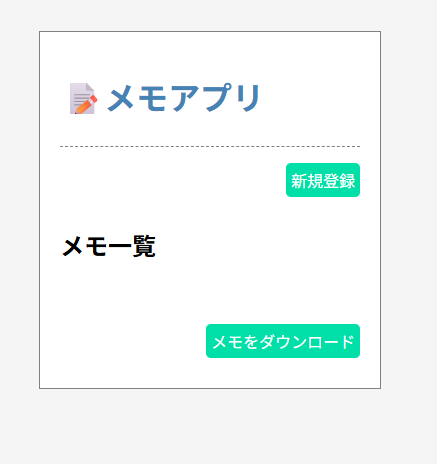
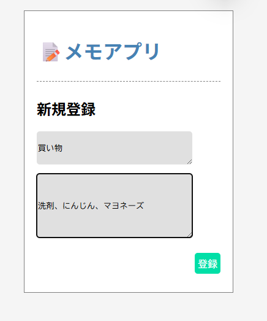
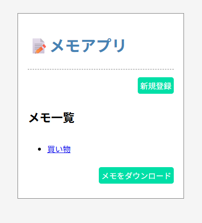
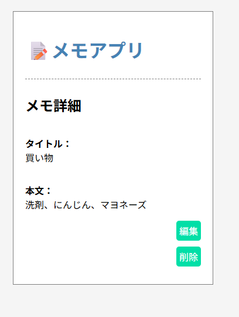
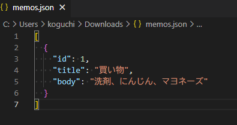

### 1. Sinatraのインストール
```bash
gem install sinatra
```

### 2. Gemfileをインストール
```bash
bundle install
```

### 3. アプリケーションの起動
```bash
bundle exec ruby app.rb
```

## 操作方法
### メモの新規追加

「新規登録」をクリック。


情報を入力して、「登録」をクリック。


登録完了すると一覧画面に移動します。登録されてることを確認してください。

### 修正・削除

一覧からメモ名をクリックすると詳細画面に移動します。
編集・削除の操作が可能です。


一覧画面の「メモをダウンロード」をクリックすると、JSON形式でダウンロードすることができます。




