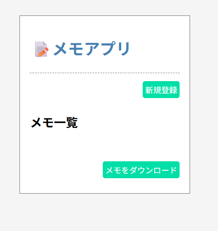
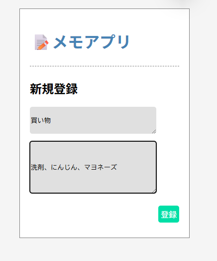
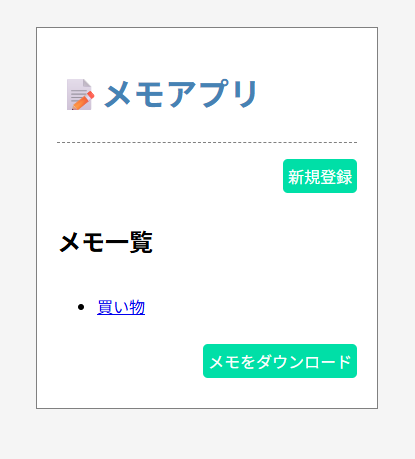
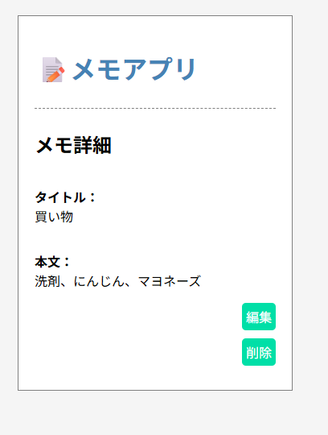
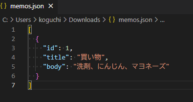

## 該当プラクティス
[プラクティス Sinatra を使ってWebアプリケーションの基本を理解する \| FBC](https://bootcamp.fjord.jp/practices/157)

## クローン～起動手順
### 前提条件
- Ruby（3.x以上推奨）がインストールされていること
- Bundlerがインストールされていること
```bash
gem install bundler
```

### リポジトリをクローン
```bash
git clone https://github.com/koguchi-e/sinatra_memo.git
cd sinatra_memo
```

### ブランチの切り替え
```bash
git checkout -b memo_practice origin/memo_practice
```

### 必要なgemのインストール
```bash
bundle install
```

### アプリケーションの起動
```bash
bundle exec rackup
```

## 使い方
### メモの新規追加
`http://127.0.0.1:9292/memos`にアクセス。
トップ画面の「新規登録」をクリック。


入力画面でタイトル・本文を入力し、「登録」をクリック。


登録完了後、一覧画面に移動。追加されたメモを確認できます。



### 修正・削除
一覧から編集したいメモ名をクリック。
詳細画面で「編集」や「削除」ができます。


一覧画面の「メモをダウンロード」ボタンから、メモ情報をJSON形式でダウンロードできます。



## 補足
`public/images/` 配下の画像は説明用です。動作自体には不要です。
